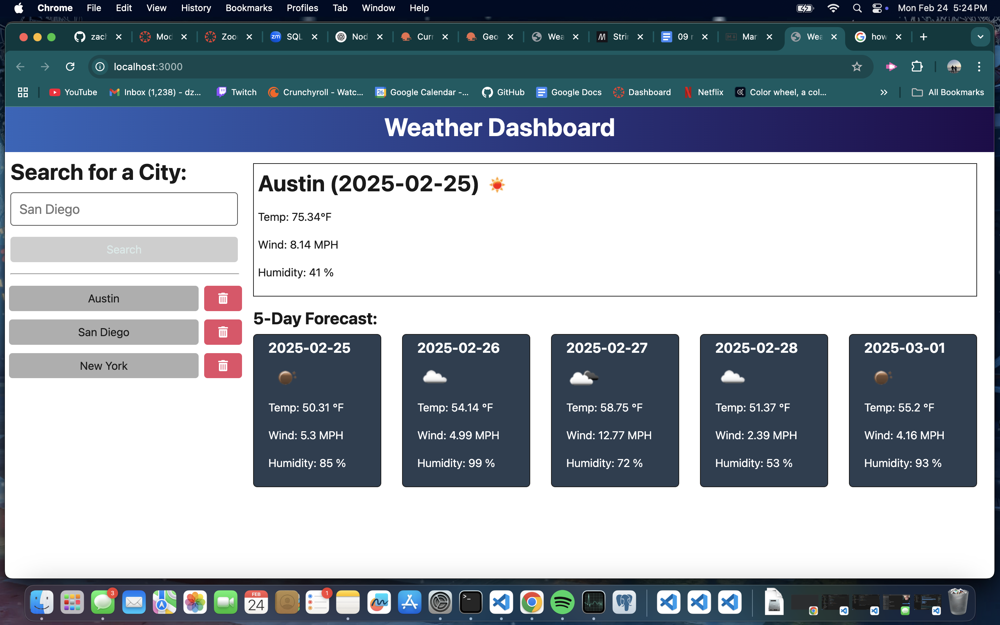

  # Weather Forecast App
  
  
  
  ## About

  The Weather Forecast app is a fleshed out application built with front and backend technologies, that utilizes 3rd party apis provided by [OpenWeather](https://openweathermap.org/) to display a 5 day weather forecast for any city that is entered in the search bar! The website will also save any search you make to a search history to make it easier to revisit forecasts!
   

   
  ## Table of Contents 
  - [Installation](#installation)
  - [Usage](#usage)
  - [Contributing](#contributing)
  - [Tests](#tests)
  - [License](#license)
  - [Questions](#questions)
   

   
  ## Installation
   
  Here are the prerequisites necessary to use the project:
   
  *Nothing but access to a browser and an internet connection!*
  
  To get started with the project, follow these steps:
   
  No installation is necessary for this application. Simply visit the deployed website [here]()
   

   
  ## Usage 
   
  Here are the steps to start the application:
   
  
  
  To use the application, do the following:

  As you open the website you will be prompted to search for a city. Click on the search bar in the top left corner and enter any city in the world, and once you do a forecast will pop up for the current day and next 5 days. The forecast will contain details like temperature (in farenheit), humidity, wind speed, and more. After making a search, your search will appear in a box under the search bar. This area is the search history, and every search will be added to this list. If you would like to remove the item from the search history, you can click on the red trash can icon to the right of the city name and it will remove it.

    
  ## Contributing
   
  Any contributions are appreciated as they are vital to the improvement and wellbeing of the project.

  If you would like to contribute, please follow these steps:

  1. **Fork the repository** to your own github account
2. **Clone the forked repository** to your local machine
3. **Create a branch** for your changes
4. **Install dependencies**, type npm install in the terminal of the code editor to install all packages required for the application (Nodejs required)
5. **Make your changes**, while ensuring they follow the project’s standards
6. **Test your changes** to verify they work
7. **Commit your changes** with a descriptive commit message
8. **Push the changes** to your forked repository
9. **Submit a pull request** from your branch to the main repository with a detailed description of the changes and any potential issues.
10. **Be responsive to feedback** and make any updates necessary.

   

   
  ## Tests
   
  In order to run tests on the project, do the following:
   
  *Tests are not yet available for this project*
   

   
  ## License 
   
  This application is covered under the MIT License. For more information, view the official documentation [here](https://opensource.org/license/MIT).
   

   
  ## Questions
   
  For any questions or assistance, please reach out through these mediums:
   
  - **Github:** [zachmc27](https://github.com/zachmc27)
  - **Email:** <dzdudes1213@gmail.com>

  